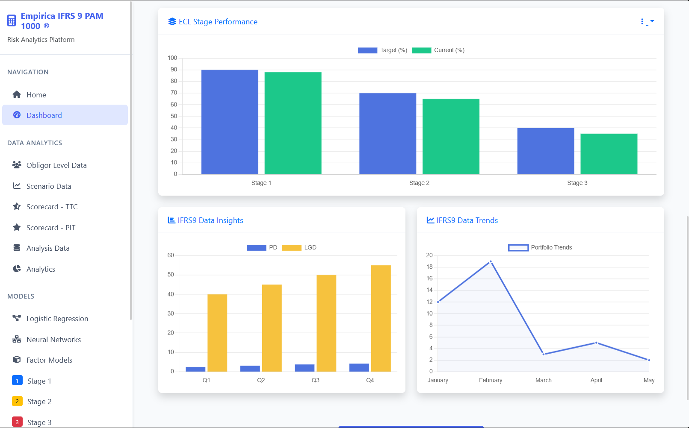
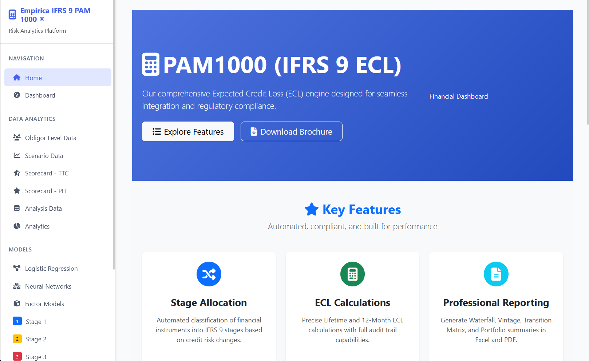
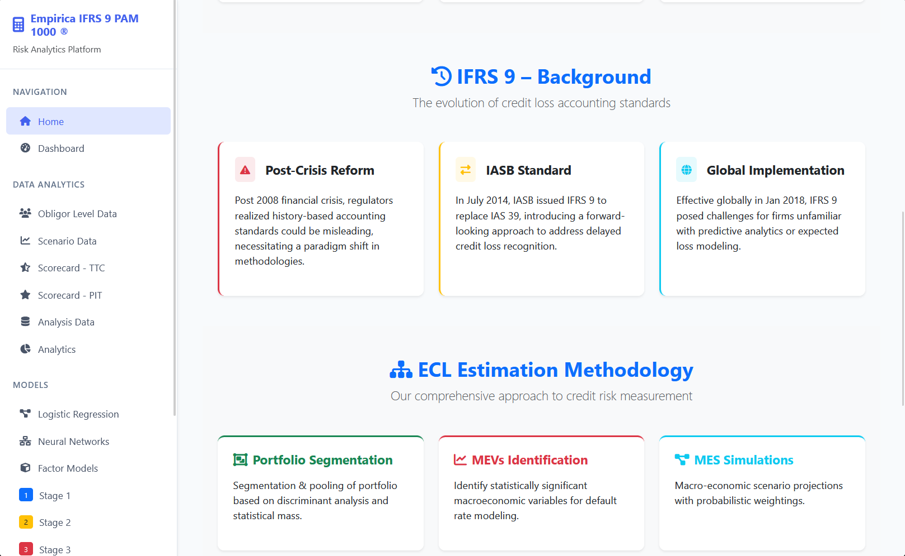

IFRS9 Expected Credit Loss (ECL) Modeling App
This application provides a web interface for running IFRS9 Expected Credit Loss (ECL) models using Django (Python) as the backend and R scripts for the core calculations.
Users can upload input files, run models, and download results and visualizations.

## 📁 Project Structure

- `analyis/` - Loan data analytics (views, templates)
- `calculations/` - Core ECL and model logic
- `ecl_calculations/` - Views and models specific to ECL workflows
- `finance/` - Financial dashboard and report integration
- `financial_statements/` - Upload and manage income, equity, and position statements
- `obligor_data/` - Predictive models (logistic regression, ML), risk scoring
- `scenario_data/` - Macroeconomic inputs (GDP, inflation, unemployment)
- `media/` - User-uploaded inputs/outputs and static resources
- `scripts/` - R scripts for ECL calculation
- `output/`, `ifrs9 output/`, `backup/` - Generated results, temporary or previous states

---

## 🧰 Features

- 📊 **Upload and manage financial statement data** (income, equity, balance sheet)
- ⚙️ **Run IFRS9 ECL calculations** with macroeconomic overlays
- 🧠 **Predict defaults using ML models** (logistic regression, neural networks)
- 📉 **Scenario analysis and stress testing**
- 🔁 **Integrate R scripts** for statistical calculations
- 📁 **Downloadable Excel outputs** for audit trails and reports
- 📌 **Interactive dashboard and visuals**

---

## 🛠️ Requirements

Install dependencies:

```bash
pip install -r requirements.txt

Make sure you have:

    Python 3.12+

    R installed (if using .R scripts)

    Django

🚀 Getting Started

1. Clone the repo
git clone https://github.com/yourusername/IFRS-9.git

2.cd ifrs-9

3.Apply migrations

 python manage.py migrate

4.Run the server

python manage.py runserver

5.Access the app
Visit: http://127.0.0.1:8000/

## 📷 Screenshots

### 🔹 Dashboard


### 🔹     Home


### 🔹 Prediction Results


        Visit: http://127.0.0.1:8000/
